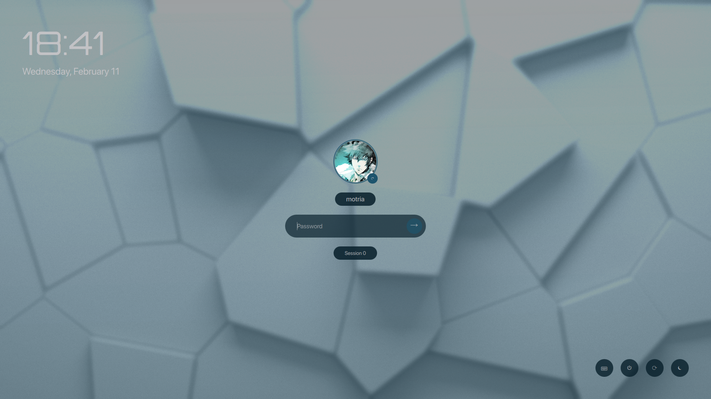
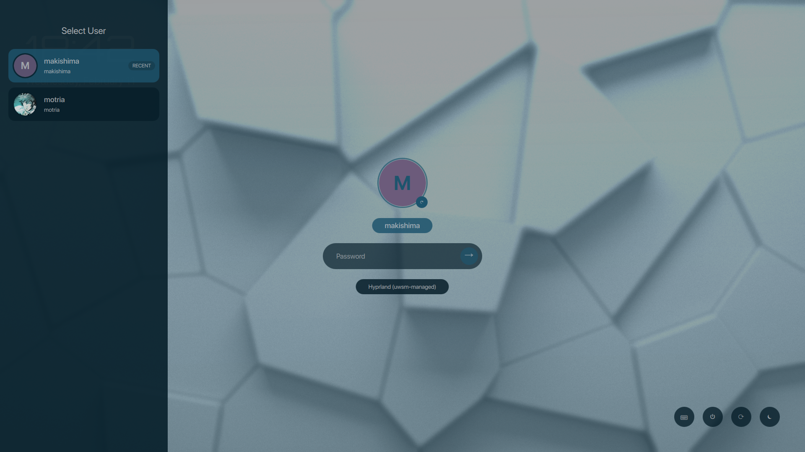
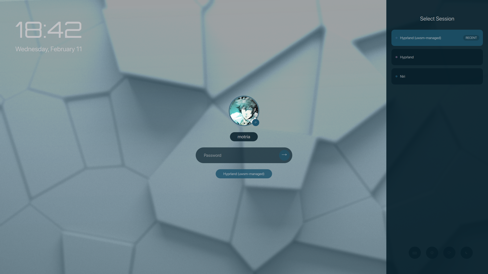
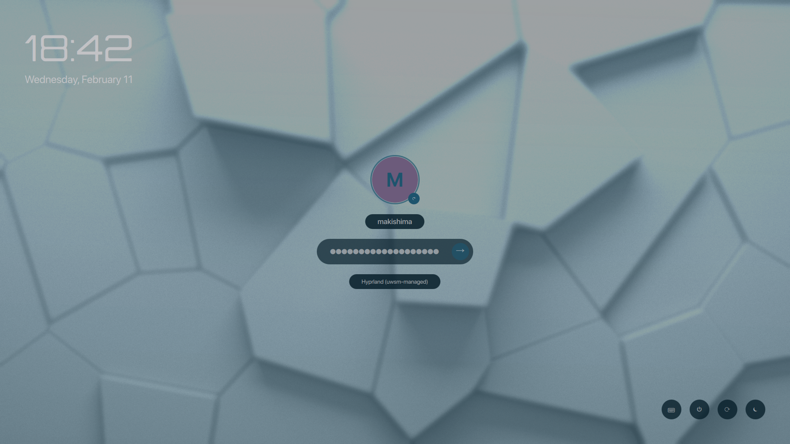
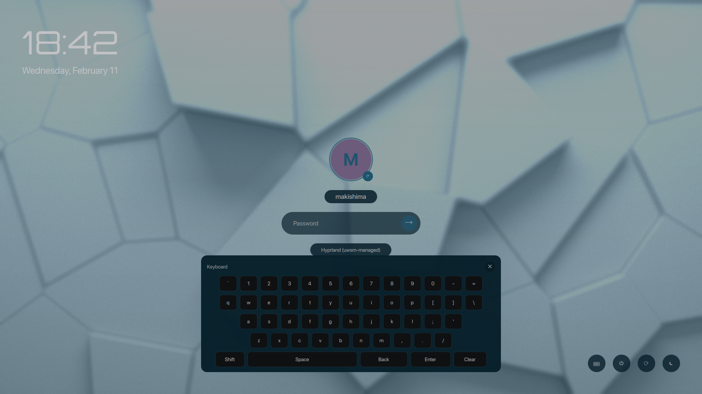

# ZeroWay

A feature-rich SDDM theme with adaptive scaling, keyboard-first UX, and tasteful ambient motion.

Tested on: `Arch Linux`

**Preview**


https://github.com/user-attachments/assets/262bef7e-d3e9-4ddd-b86e-3b91d5837460








**What This Project Is**
- A standalone, open-source SDDM theme implementation built with QML.
- A customization layer over SDDM's greeter engine (not a replacement display manager).
- A UI/UX + frontend systems project focused on login experience quality.

**Features**
- Adaptive layout scaling for different resolutions and aspect ratios.
- Ambient motion background (subtle, configurable).
- Spotlight focus glow for active elements.
- Keyboard-first flow with quick toggles.
- Preview mode for screenshots and demos.
- Monogram fallback avatars with stable accent colors.
- Improved error feedback.

**Keyboard Shortcuts**
- `Alt+U` toggle user list
- `Alt+S` toggle session list
- `Esc` close sidebars
- `Tab` / `Shift+Tab` cycle focus
- `Enter` submit login when focused

**Known Behavior**
- On-screen keyboard (OSK) input is currently wired to the password field only (not user/session search fields).

**Quick Setup (Recommended)**
1. Clone the repository:
```bash
git clone https://github.com/mbamotria/ZeroWay.git
cd ZeroWay
```
2. Install in one command:
```bash
make install
```
3. Restart SDDM or reboot.

The installer will:
- Copy the theme to `/usr/share/sddm/themes/ZeroWay`
- Write `/etc/sddm.conf.d/10-zeroway-theme.conf`
- Backup any previous `ZeroWay` theme directory before replacing it

To uninstall:
```bash
make uninstall
```

Install files only (does not activate theme):
```bash
make install-files
```

**Manual Setup**
1. Copy this project folder to `/usr/share/sddm/themes/ZeroWay`.
2. Create `/etc/sddm.conf.d/10-zeroway-theme.conf` with:
```ini
[Theme]
Current=ZeroWay
```
3. Restart SDDM or reboot.

**Rollback**
- If installer created a backup, restore the backup directory in `/usr/share/sddm/themes/`.
- Change `Current=` in your SDDM theme config to your previous theme.

**Configuration**
All theme options live in `theme.conf`.

| Key | Default | Description |
| --- | --- | --- |
| `background` | `WhiteAbstract.jpg` | Background image path. |
| `avatar_base_paths` | `/var/lib/AccountsService/icons,/usr/share/sddm/faces,/usr/local/share/sddm/faces` | Comma-separated avatar directories, tried in order. |
| `color_text` | `#C2C2C5` | Primary text color. |
| `color_bg` | `#0F0E0E` | Background overlay color. |
| `color_panel` | `#061E29` | Panel and card color. |
| `color_accent` | `#1D546D` | Accent and focus color. |
| `color_error` | `#ff6b6b` | Error color. |
| `accent_palette` | `#1D546D,#2B7A78,#3A506B,#5C4B51,#6C5B7B,#355C7D` | Palette for avatar/session dots. |
| `font_primary` | `SF Pro Display` | UI font. |
| `font_display` | `Orbitron` | Clock font. |
| `time_size` | `88` | Clock size. |
| `date_size` | `26` | Date size. |
| `title_size` | `22` | Sidebar title size. |
| `username_size` | `18` | Username size. |
| `password_size` | `17` | Password size. |
| `session_size` | `14` | Session size. |
| `profile_initial_size` | `48` | Center avatar initial size. |
| `avatar_initial_size` | `24` | Sidebar avatar initial size. |
| `refresh_icon_size` | `14` | Refresh icon size. |
| `power_icon_size` | `22` | Power icon size. |
| `login_icon_size` | `24` | Login arrow size. |
| `outer_margin` | `60` | Screen margin. |
| `center_spacing` | `24` | Center column spacing. |
| `sidebar_width` | `400` | Sidebar width. |
| `user_item_height` | `80` | User row height. |
| `session_item_height` | `64` | Session row height. |
| `login_box_width` | `380` | Password box width. |
| `login_box_height` | `62` | Password box height. |
| `scale_base_width` | `1920` | Base width for scaling. |
| `scale_base_height` | `1080` | Base height for scaling. |
| `scale_min` | `0.8` | Minimum scale factor. |
| `scale_max` | `1.6` | Maximum scale factor. |
| `blur_radius` | `2` | Background blur radius. |
| `overlay_opacity` | `0.35` | Dark overlay opacity. |
| `ambient_enabled` | `1` | Enable ambient motion layer. |
| `ambient_opacity` | `0.18` | Ambient layer opacity. |
| `ambient_speed` | `28000` | Ambient animation duration in ms. |
| `shader_enabled` | `1` | Enable subtle shader overlay. |
| `shader_strength` | `0.12` | Shader opacity/strength. |
| `shader_speed` | `36000` | Shader animation duration in ms. |
| `shader_tint` | `#1E4254` | Shader tint color. |
| `spotlight_enabled` | `0` | Enable focus spotlight. |
| `sidebar_search_enabled` | `0` | Show search bars in sidebars. |
| `osk_enabled` | `1` | Enable on-screen keyboard. |
| `osk_default_open` | `0` | Start with OSK open. |
| `debug_logging` | `0` | Enable verbose console logging for debugging. |
| `osk_width` | `820` | OSK panel width. |
| `osk_height` | `320` | OSK panel height. |
| `preview_enabled` | `0` | Enable preview mode. |
| `preview_user` | `jane` | Preview username. |
| `preview_display` | `Jane Doe` | Preview display name. |
| `preview_session` | `Hyprland` | Preview session name. |
| `preview_users` | `jane:Jane Doe|alex:Alex Kim|river:River Gray` | Preview user list. |
| `preview_sessions` | `Hyprland|Plasma|GNOME|XFCE|i3` | Preview session list. |
| `anim_fast` | `120` | Fast animation duration. |
| `anim_medium` | `200` | Medium animation duration. |
| `anim_sidebar` | `220` | Sidebar animation duration. |

**Preview Mode**
Set `preview_enabled=1` and tweak `preview_user`, `preview_display`, `preview_users`, and `preview_sessions` for clean screenshots.

**Acknowledgements**
- Wallpaper source (Freepik): [Abstract extruded Voronoi blocks background](https://www.freepik.com/free-photo/abstract-extruded-voronoi-blocks-background-minimal-light-clean-corporate-wall-3d-geometric-surface-illustration-polygonal-elements-displacement_11221128.htm#fromView=keyword&page=1&position=9&uuid=f2c1f9c4-8208-4c01-8cc4-a21e7820e489&query=4k+white+background)
- Thanks to the SDDM project and the Linux desktop community for the greeter theming ecosystem.
